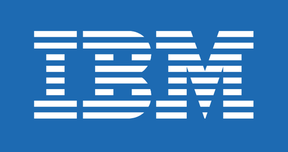
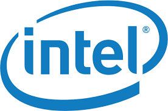

+++
title = "The Information Age"
script = "script.js"
+++

# The Information Age

[!](highlight)

What drives us toward data?
===========================

- [!](fragments)
- [!](nobullet)
- [!](comfort)
- Money
- Power
- and improvements to the environment, society and life

[!](break)

[!](middle)

[!](box) Let's talk about the exciting digital age that started in 1960's.

# Chapter 1: Money

[!](highlight)

## 1960 - 1990

1960-1980: Individualism and Consumer-ism
=========================================================

- Every person was to have several banking accounts.

- Every person was to have several credit cards.

- Every person was to have several reward cards.

----

[!](box) For the first time, **banks** had exceeded the data capacity of
human-machine systems.

1960-1980: Computer Science to the rescue
=========================================================

[!](columns 4:)

The start-up was...

[!](split)

</img>

# ____________________

## Innovation #1

- 1966: IBM **IMS** (*Information Management System*)

    > - [!](comfort)
    > - Hierarchical database
    > - Special hardware designed to support IMS: IBM 2740, System/360
    > - Special operating system designed to support the hardware, z/OS
    > - IMS **is** still in production **today**, with support for Java, JDBC
    > and interfaces to the Web and mobile devices.

[!](note 5) </img>

# ______________________

## Innovation #2

[!](columns 7:)

- 1970: IBM **System/R** and **SQL**

    > - [!](comfort)
    > - Algorithms from System/R is still used in the design of Google Big Data.
    > - One of many descendants of System/R is SQLite, the embedded database in
    > 100 millions mobile devices.
    > - The special **query language** SQL was designed in 1974, and it is still
    > being used by Google, Facebook and millions of software developers.

[!](split)

    

        </img>
        
Jim Gray: Relational Database

    

    

        </img>
        
Don Chamberlin: SQL

    

# _______________________

## Innovation #3

[!](columns 7:)

- 1977: Oracle

    > - [!](comfort)
    > - The most successful enterprise database product.
    > - Holds ownership of 
    >
    >     1. **Java**: the most popular programming language
    >     2. **MySQL**: the most popular database to power Web apps

[!](split)

</img>

Founders of Oracle: Larry Ellison, Lawrence Joseph

# The Consequence

[!](middle)

[!](box) These computer scientists were heros that created possibilities never
seen before in history.

1990: US Corporations
=====================================================

## Star Alliance

[!](columns 4:)

> - [!](comfort)
> - 27 + 40 different **airline** companies sharing a single pool of customers.
> - Established in 1997

[!](split)

</img>

# _________________________

## Walmart

[!](columns 5:)

> - [!](comfort)
> - The first department that recognized the **competitive** advantage of
> **data**.
> - Every transaction since 1990 has been permanently archived for analysis.
> - Went **international** in 1990.

[!](split)

</img>
</img>

# _______________________

## Air Miles and other reward programs

[!](columns 5:)

> - [!](comfort)
> - Founded in 1992
> - Created the first large-scale social networks involving customers and
> businesses.

[!](split)

</img>

# The **Market**

[!](columns 5:)

> - [!](comfort)
> - Outcry trading before 1980s
> - Electronic trading terminals starting in 1988

[!](split)

    </img>
    </img>

Chapter 2: Power
=========================================================

[!](highlight)

### 1990 - 2010

1990 - ? : Power to Technology
========================================================

- [!](nobullet)
- [!](comfort)

- The world was **so transformed** by the ability to archive and process data,
  virtually all sectors of society became **data centric**.

- Almost all of technology was dedicated to **data**.

- [!](box) The world was hold hostage by technology.

# _____________________________________

[!](columns 5:)

## Technology companies became **powerful**.

[!](split)

### 1990 - 2000

---

    </img>
    </img>
    </img>
    </img>
    </img>
    </img>
    </img>
    </img>
    </img>
    </img>
    </img>

# _____________________________________

- Technology for **everyone**

    > 1. Personal computers
    > 2. Gaming

- Telecommunication

    - 1990: 2,400 bits/s
    - 1995: 19,200 bits/s
    - 2000: 1,000,000 bits/s
    - 2010: 5,000,000 bits/s
    - 2017: 25,000,000 bits/s (ten thousand times improvement)

# ____________________________________

## A new wave of data explosion

- 1990: Emails (1,000 universities)
- 2000: Web pages
- 2010: Blogs
- 2017: Instagram / Twitter / Youtube / Facebook 

[!](&&&)

### Internet-scale = 1 exabyte

- 1 exabyte = $10^{18}$ bytes
- Global data volume reached 800 exabytes in 2009
- Google holds over 10 exabytes  of data.

# ___________________________________

## Examples of exabytes

[!](box) If we write done **every word** spoken or written since the beginning
of writing (_remember the <b>clay tablets</b>_?), it is **5 exabytes**.

[!](box) One exabyte can hold **100,000 $\times$** all printed material in the
**Library of Congress**.

[!](box) **Cellphones** exchange **75 exabytes** of data each year.

[!](box) One gram of **DNA** can hold **455 exabytes** of information.

Database systems of the new millennium
=======================================================================

[!](columns 8:)

### Exabyte-range databases

</img>

> [!](note 10)
> 30 million users generating and consuming data in real-time 24 $\times$ 7.
>
> - **Hive** (distributed relational data store)
> - **Cassandra** (NoSQL data store)

</img>

> [!](note 10)
> Holding over 10 exabytes of data, many copies of the WWW, running on over
> 900,000 computers.
>
> - **Big Table** (2004)
> - **Dremel** (2010)
> - **F1** (2013)

[!](split)

- [!](fragments)
- [!](comfort)
- They are *not* your 1990 databases anymore.
- They are not for sale.
- Hive / Cassandra are opensource projects.
- Big Table is a paid service.
- Dremel and F1 are secret sauces in Google.
- **All hardware environments are kept secret**.

# ________________________________

[!](columns 4:)

## Billions of databases

- Each person has multiple devices.

- Each device is running multiple databases (**SQLite**).

- Data is then uploaded to data centers (**Millennia databases**).

[!](split)

</img>
</img>
</img>
</img>
</img>
</img>
</img>
</img>
</img>
</img>
</img>
</img>
</img>
</img>
</img>
</img>
</img>
</img>
</img>
</img>
</img>
</img>
</img>
</img>
</img>
</img>
</img>
</img>
</img>
</img>
</img>
</img>
</img>
</img>
</img>
</img>
</img>
</img>

2000 - 2010: The Consequence
==============================================================

#### Super-rich corporations

> [!](note 9) 
>
> </img>
> According to [Forbes,
2014](http://www.forbes.com/sites/timworstall/2014/04/13/fun-number-apple-has-twice-as-much-cash-as-the-us-government/#301ca92d386d),
> Apple Computers has twice the cash reserve as the US Federal Reserve in 2014.
> This gap probably has widened.

#### Super-rich individuals

> [!](note 9)
>
> - [!](nobullets)
> - [!](comfort)
> - </img> Chad Hurley, Steve Chen,
> Jawed Karim founded **Youtube** in Feb 2005 in their
>   San Francisco apartment.
>
> - It was acquired by Google **18 months** later in 2006 for $1,600,000,000.
>
> - They got paid: 2.9 Million Dollars / Day for their work.

2010 - 2017: The Consequence
==================================================================

[!](columns 3:)

#### A new wave of powerful US corporations

[!](split)

    </img>
    </img>
    </img>
    </img>
    </img>
    </img>
    </img>
    </img>
    </img>
    </img>

2010 - 2017: The Consequence
==================================================================

[!](columns 10:)

#### Privacy Against Surveillance

> [!](note 8)
> </img>
>
> Edward Snowden, 2013

#### Freedom to information

> [!](note 8)
> </img>
>
> Aaron Swartz, Founder of Reddit, 2012

[!](split)

  <red>POWER</red> TO THE <blue>PEOPLE</blue>

Chapter 3: Improvements to the environment, society and human life
==================================================================

[!](highlight)

### 2015 - NOW

The environment
========================================================

## The rise of electric vehicles

[!](columns 6:)

</img>
</img>

[!](split)

- Elon Musk

- Founder of Paypal

Society
========================================================

[!](columns 5:)

#### Y-combinator Venture (Nonprofit) Fund

[!](split note)

- [!](fragments)
- Copia

    > COPIA easily connects businesses with surplus food to local nonprofits in
    > need

- Giveeffect

    > Fundraising, volunteer, and donor management software for your nonprofit

- One Degree

    > Community resources, just for you. The easiest way to find, manage, and
    > share nonprofit services for you and your family

- Watsi

    > Watsi is an online peer-to-peer crowdfunding platform that allows users to
    > fund life-changing medical treatments for underserved people in developing
    > countries

2015: The Ebola virus outbreak
========================================================

</img>

# ___________________________________

</img>

# _________________________________

- Warning came from _data scientists_:

    > Eurosurveillance, Volume 19, Issue 36, 11 September 2014
    > 
    > Rapid communications
    >
    > "EARLY TRANSMISSION DYNAMICS OF EBOLA VIRUS DISEASE (EVD), WEST AFRICA, MARCH
    > TO AUGUST 2014"
    >
    > 1. *H Nishiura*, University of Tokyo, Japan
    > 2. *G Chowell*, Arizona State University, USA

# __________________________________

- The prediction

    > </img>

- The data science

    > </img>

# __________________________________

## The cure

- Ebola Vaccine: Team B (23 members over dozens of universities)

    <pre style="height:400px; 
    overflow:scroll; 
    border: thin solid black; 
    width: 600px;
    padding: 10px;
    font-size: 6pt;">
    Jon Andrus, MD
    Executive Vice President
    Sabin Vaccine Institute
    USA

    Norman W. Baylor, PhD
    President and CEO
    Biologics Consulting Group, Inc.
    USA

    Fred Binka, PhD MPH
    Professor, University of Health and Allied Sciences
    Ho, Ghana

    John D. Clemens, MD
    Executive Director
    International Centre for Diarrhoeal Disease Research, Bangladesh
    Dhaka, Bangladesh

    Tumani Corrah, MD PhD CBE MRG
    Director
    Africa Research Excellence Fund, MRC Unit
    The Gambia

    R. Gordon Douglas, Jr, MD
    Professor Emeritus of Medicine
    Weill Cornell Medical College
    USA

    Ogobara K. Doumbo, MD PhD
    Professor and Chair, Department of Epidemiology of Parasitic Diseases
    Director, Malaria Research and Training Center
    Chair of Foundation Mérieux Infectious Diseases Programs
    Faculty of Medicine, University of Bamako
    Mali

    Arthur Y. Elliott, PhD
    President
    Biological Consultant
    USA

    Patricia Fast, MD PhD
    Senior Technical Advisor
    International AIDS Vaccine Initiative
    USA

    Thomas R. Fuerst, PhD
    Professor and Director
    Institute for Bioscience and Biotechnology Research
    University of Maryland
    USA

    Christian Happi, PhD
    Professor and Dean, College of Postgraduate Studies
    Director, World Bank-funded African Center of Excellence for Genomics of
    Infectious Diseases
    Redeemer's University Mowe
    Ugun State, Nigeria

    Pontiano Kaleebu, MD PhD
    Director, MRC/UVRI Uganda Research Unit on AIDS
    Entebbe, Uganda

    David C. Kaslow, MD
    Vice President, Product Development
    PATH
    USA

    Marc Lipsitch, DPhil
    Professor of Epidemiology
    Director, Center of Communicable Disease Dynamics
    Harvard T.H. Chan School of Public Health
    USA

    Adel A. Mahmoud, MD PhD
    Professor in Molecular Biology and Public Policy
    Princeton University
    USA

    Walter Orenstein, MD
    Associate Director, Emory Vaccine Center
    Emory University
    USA

    George Poste, DVM PhD DSc
    Chief Scientist, Complex Adaptive Systems Initiative
    Arizona State University
    USA

    Julien Potet, MSc
    Policy Advisor, Neglected Tropical Diseasesand Vaccines
    Médecins Sans Frontières Access Campaign 

    Regina Rabinovich, MD MPH
    ExxonMobil Malaria Scholar in Residence
    Dept. of Immunology and Infectious Diseases
    Harvard School of Public Health
    USA

    Amadou Alpha Sall, PhD
    Director, WHO Collaborating Centre for Arboviruses and Viral Hemorrhagic
    Fever
    Scientific Director, Institut Pasteur de Dakar
    Senegal

    Faisal Shuaib, MD DrPH
    Senior Advisor, Federal Ministry of Health
    Nigeria

    Peter G. Smith, CBE BSc DSc
    Professor, MRC Tropical Epidemiological Group
    London School of Hygiene & Tropical Medicine
    UK

    Ross Upshur, MD MSc
    Head, Division of Clinical Public Health, Dalla Lana School of Public Health
    Scientific Director, Bridgepoint Collaboratory for Research and Innovation
    Canada Research Chair in Primary Care Research
    Professor, Department of Family and Community Medicine and Dalla Lana School
    of Public Health, University of Toronto
    CANADA
    </pre>

# _________________________________

- Massive data generation

- Data exchange

- Data processing and analytics

The human life
================================================================

[!](columns 6:)

The old way:

> </img>

IBM Watson:

> </img>

[!](split)

- 2015: IBM is already used by Cedars-Sinai Cancer Institute at Los Angeles

- 2017: [Stanford Artificial
  Intelligence](http://www.theverge.com/2017/1/26/14396500/ai-skin-cancer-detection-stanford-university) computer vision system detects ski cancer as well as a professional doctor.

Technology is the key
=================================================================

- Data Science

- Artificial Intelligence and Deep Learning based Databases

- Massively scalable and self-generating data processing algorithms and systems

---

[!](columns 4:)

We are still just starting to tackle these problems:

[!](split)

    </img>
    </img>
    </img>
    </img>

Chapter 4: The Future
===================================================================

[!](highlight)

The future
===================================================================

- We will continue to expand our appetite for data and the ability to make sense
    and make use of data.

- Computer Science and Data Science are the key to that goal.

[!](&&&)

- _Let us not forget..._

    > 1928: Kurt Godel's **Incompleteness Theorem**
    >
    > ---
    > 
    > Any sufficiently useful logic must necessarily be incomplete.

# ___________________________

### Needs *You*!

[!](&&&)

## and you need...

    <table class="final">
        <tr>
            <td class="a"> Programming </td>
            <td class="b"> Algorithms </td>
        </tr>
        <tr>
            <td class="c"> Mathematics </td>
            <td class="d"> Software Design </td>
        </tr>
    </table>
    
 = Computer Science

